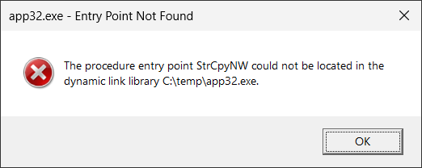

# importando

Importando (**import and o**verride :smirk:) is a console application that allows you to modify PE image imports on process start.

Command line options:

```
importando [options] <executable> [args]

Options:
    -i <import_definition>
    -i <import_definition1>:<import_definition2>
        Add a new import to the executable or forward an existing import. This option can be specified multiple times.
    -v
        Print verbose output.
    -h, --help
        Print this help message.

Possible import_definition:
  dll_name.dll!function_name - import by name
  dll_name.dll#ordinal - import by ordinal

Examples:
  importando -i test.dll#1 -i kernelbase.dll!CreateFileW:trace.dll!CreateFileW cmd.exe
```

## Installation

No installation is required, [download the binaries](https://github.com/lowleveldesign/importando/releases) and run it.

**The executable is 64-bit, but works with both 64- and 32-bit executables.**

## When to use

You may use importando to inject a new DLL at a process start (in this mode, it works similarly to [withdll](https://github.com/lowleveldesign/withdll)), but also to fix issues with imports such as the one below:



The fix would be to add a forward: `importando.exe -i shell32.dll!StrCpyNW:shlwapi.dll!StrCpyNW c:\temp\app32.exe`.

## How it works

If you are interested how importando works, have a look at [this blog post](https://lowleveldesign.wordpress.com/2023/12/18/updating-pe-file-imports-on-process-start/) on my blog.

## How to make the fix persistent

You may install importando as a **Image File Execution Options debugger** for a given executable, which would modify the process imports table on every application launch. For example:

```
Windows Registry Editor Version 5.00

[HKEY_LOCAL_MACHINE\SOFTWARE\Microsoft\Windows NT\CurrentVersion\Image File Execution Options\app32.exe]
"Debugger"="c:\\tools\\importando.exe -i shell32.dll!StrCpyNW:shlwapi.dll!StrCpyNW
```
